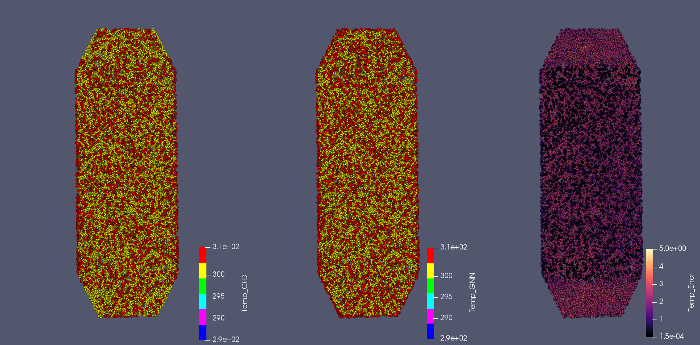
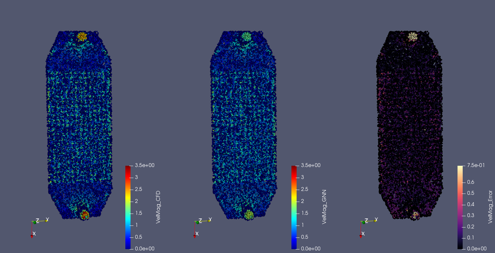
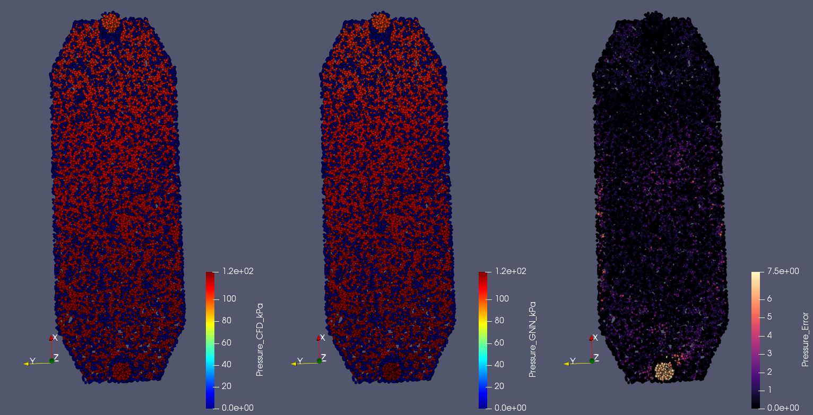
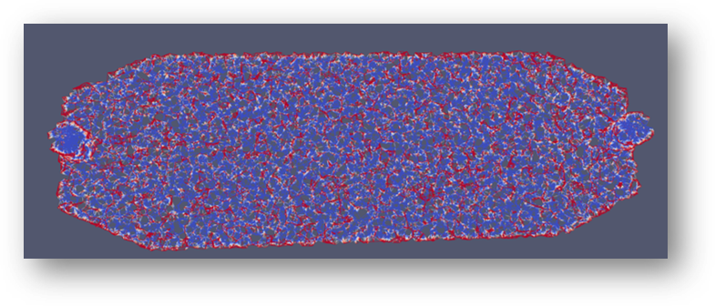

# Physics-Informed Graph Neural Network for CFD Acceleration
This repository contains the implementation of Graph Neural Networks (GNNs) and Physics-Informed Graph Neural Networks (PI-GNNs) for accelerating steady-state 
Conjugate Heat Transfer (CHT) simulations of liquid-cooled cold plates. The framework learns state-to-state transitions on CFD mesh graphs and predicts thermal and fluid fields including temperature, pressure, and velocity for complex cooling geometries such as pin-fin arrays and Triply Periodic Minimal Surface (TPMS) structures. The project was developed as part of a Master's thesis investigating machine learning  approaches for accelerating CFD-supported thermal management design workflows.
## Overview
This repository contains the implementation of Graph Neural Networks (GNNs) and Physics-Informed Graph Neural Networks (PI-GNNs) for accelerating steady-state 
Conjugate Heat Transfer (CHT) simulations of liquid-cooled cold plates. The objective is to develop a mesh-based surrogate model capable of predicting thermal and fluid states on complex cooling geometries. The framework operates directly on unstructured CFD meshes by representing the computational domain as a graph.

The investigated geometries include:

- Pin-fin cooling structures
- Triply Periodic Minimal Surface (TPMS) geometries

The model predicts:

- Temperature field (T)
- Pressure field (p)
- Velocity components (u, v, w)

The developed approach focuses on accelerating the final convergence phase of CFD simulations through state-to-state prediction rather than replacing the CFD 
solver completely.
## Research Motivation
Modern power-electronic systems require efficient thermal management as power densities increase. Liquid-cooled cold plates provide an effective cooling solution, 
but evaluating complex internal cooling structures using Computational Fluid Dynamics (CFD) remains computationally expensive. Additive manufacturing enables complex cooling architectures such as pin-fin arrays and TPMS structures, increasing the design space that needs to be evaluated. This work investigates Graph Neural Networks as surrogate models operating directly on unstructured CFD meshes.
## Methodology
The workflow consists of four main stages:

### 1. CFD Data Generation

High-fidelity CFD simulations are performed to generate training and testing data 
for different cooling geometries.

The simulations provide:
- Mesh information
- Temperature fields
- Pressure fields
- Velocity fields

### 2. Mesh-to-Graph Conversion

The unstructured CFD mesh is converted into a graph representation.

Each mesh point becomes a graph node containing physical features, while mesh 
connectivity defines the graph edges.

### 3. Graph Neural Network Learning

The GNN learns the relationship between intermediate CFD states and final 
converged solutions.

### 4. Physics-Informed Extension

The baseline GNN is extended by introducing physics-based constraints derived 
from governing equations:

- Conservation of mass
- Momentum equations
- Heat transfer equations

These physics-informed losses encourage physically consistent predictions.
## Model Architecture
Detailed explanation in the research
## Repository Structure
Detailed explanation in the research
## Implemented Models
Detailed explanation in the research
## Data Pipeline
CAD Model Generation --> Simulation (OpenFoam) --> Preprocessing --> Graph Neural Network training --> Adding Physcis --> Physics-Informed Graph Neural Networl
## Training and Evaluation
Training uses the Adam optimizer with a defined learning rate. 
Evaluation strictly relies on unseen geometries to test generalization. Performance is measured using Mean Absolute Error (MAE), Root-Mean-Square Error (RMSE), and the assessment of physical consistency.
## Results
TPMS geometries: Both models (Pure GNN and PIGNN) successfully reproduce the internal flow and temperature fields. Prediction errors, as physically expected, concentrate on the extreme geometric boundaries at the inlet and outlet manifolds.   Pin-fin geometries: The purely data-driven GNN fails to resolve local, obstacle-induced pressure variations. The PIGNN reduces the MAE pressure by more than 90% (from 3.886 kPa to 0.312 kPa) in the internal area. Likewise, PIGNN significantly reduces the MAE of the temperature forecast (from 9.535 K to 2.468 K) and prevents systematic underestimations.

## Results Visualization

The following figures show representative examples of the Physics-Informed Graph Neural Network (PIGNN) prediction capability for a pin-fin cooling structure.

The proposed framework operates as a state-to-state surrogate, where an intermediate CFD solver state is provided as input, and the network predicts the corresponding developed solution state.

The visualizations demonstrate:
- reconstruction of temperature fields,
- prediction of velocity fields,
- prediction of pressure fields,
- conversion of CFD mesh data into a graph representation using voxel coarsening and KNN connectivity.

Detailed quantitative evaluations, error metrics, and comparisons between different pin-fin and TPMS geometries are provided in the associated research document.

### Temperature Field Prediction

### Velocity Field Prediction

### Pressure Field Prediction

### Mesh Coarsening and KNN Graph Construction

## Technologies
- Python
- PyTorch
- Graph Neural Networks
- Physics-Informed Machine Learning
- OpenFOAM / SimScale
- Grasshopper / nTopology
- CFD preprocessing
- HPC / SLURM
## Limitations
Detailed explanation in the research
## Future Work
Detailed explanation in the research
## Citation
Philkhana, VRA (2026). Physics-Informed Graph Neural Network Framework for the Thermal Management of Electronic Components (Master's thesis). Deggendorf Technical University.
